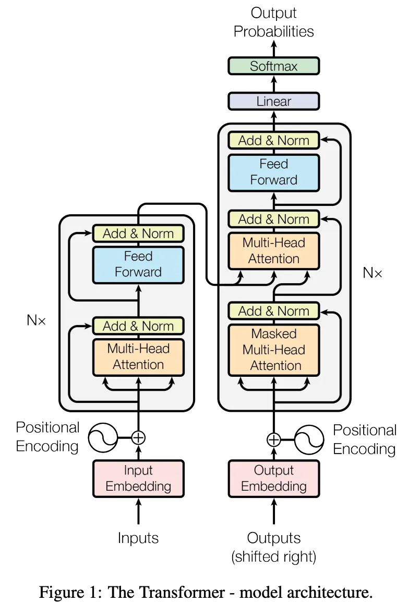
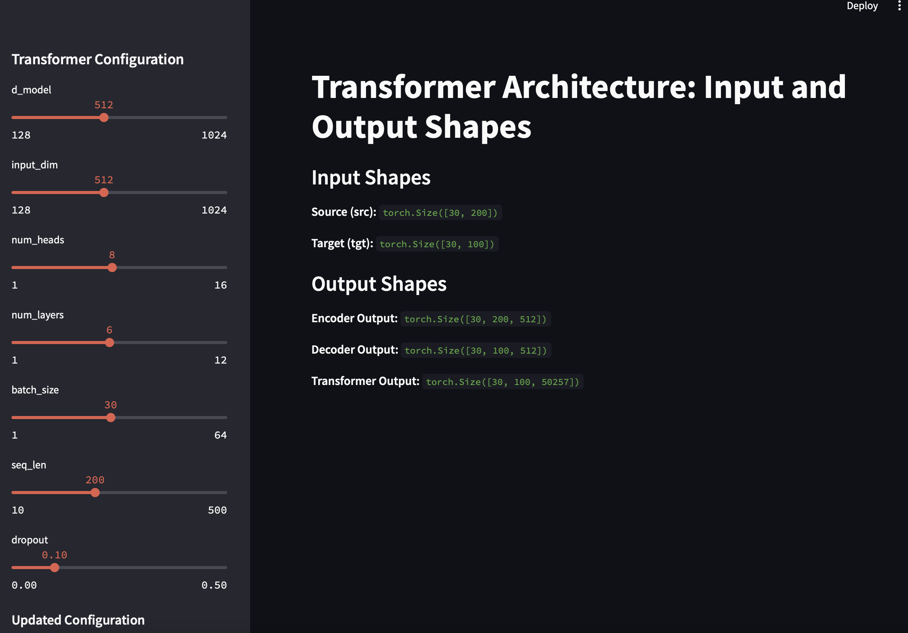

# Transformer Architecture Streamlit App

This Streamlit application is designed to help you understand the input and output shapes of a Transformer architecture.

It allows you to configure various parameters of the Transformer model and visualize the shapes of the inputs and outputs at different stages of the architecture. Additionally, you can train the model and monitor the training progress and loss.

## Features

- **Visualize Input and Output Shapes**: See the shapes of the source, target, encoder output, decoder output, and final transformer output tensors.
- **Configurable Parameters**: Adjust the model configuration parameters such as `d_model`, `input_dim`, `num_heads`, `num_layers`, `batch_size`, `seq_len`, and `dropout` using Streamlit sliders.
- **Training**: Train the Transformer model with a specified number of epochs and visualize the training loss using a line chart.
- **Interactive UI**: Use Streamlit's interactive elements to control the model configuration and start the training process.

## Getting Started

### Prerequisites

- Python 3.7 or higher
- Streamlit
- PyTorch

### Installation

1. Clone the repository:

   ```sh
   git clone https://github.com/yourusername/transformer-streamlit-app.git
   cd transformer-streamlit-app
   ```

2. Install the required packages:
   ```sh
   pip install -r requirements.txt
   ```

### Running the App

1. Save the provided Python script in a file, e.g., `app.py`.

2. Run the Streamlit app:
   ```sh
   streamlit run app.py
   ```

### Using the App

1. **Configure Parameters**: Use the sliders in the sidebar to adjust the Transformer configuration parameters.

2. **Visualize Shapes**: The main section of the app will display the shapes of the input and output tensors.

3. **Train the Model**: Set the number of epochs and click the "Start Training" button to begin training. Monitor the training progress and loss in real-time.

## Example

Below is an example of how the application displays the input and output shapes and training progress:





## Code Overview

The main parts of the code include:

- **Model Initialization**: Initializes the Transformer model with the specified configuration.
- **Input and Output Shape Visualization**: Displays the shapes of various tensors in the Transformer architecture.
- **Training Loop**: Allows for training the model, updating progress bars, and visualizing the loss.

## Contributing

Contributions are welcome! Please feel free to submit a Pull Request.
